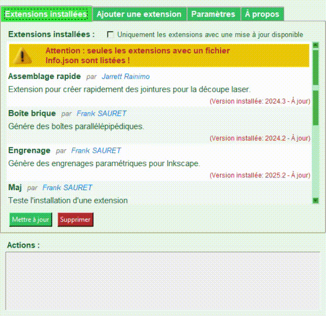

# ✨ Gestionnaire d’extensions Inkscape – Maj

 **Maj** est un gestionnaire d’extensions pour Inkscape, permettant d’installer, mettre à jour, valider et gérer facilement vos extensions depuis une interface graphique moderne.

## 🚀 Fonctionnalités principales

- **🔍 Scan des extensions installées**  
	Parcourt le dossier utilisateur, détecte les extensions, affiche leur état et version.

- **📦 Installation & désinstallation**  
	Installe ou retire des extensions en un clic.

- **🛠️ Mise à jour automatique**  
	Vérifie les mises à jour disponibles et propose l’upgrade des extensions obsolètes.

- **🌐 Gestion des dépôts**  
	Supporte les dépôts GitHub, Gitlab, Codeberg et Bitbucket, avec ajout/suppression de sources. Possibilité aisée d'ajout d'autre dépot. Attention seul Github a été testé.

- **🖼️ Interface graphique personnalisée**  
	Utilise Tkinter avec des widgets colorés, tooltips avancés, icônes, et styles configurables.

- **🧪 Validation**  
	Vérifie la compatibilité, l’intégrité et le format des extensions (Info.json, fichiers, version).

- **📝 Configuration flexible**  
	Personnalisation des couleurs, polices, sujets et préférences via un fichier config.

## 🖥️ Aperçu de l’interface


## ⚙️ Structure du projet

```
Maj/
│
├── core/         # Logique métier : installer, valider, updater, gestion des dépôts
├── gui/          # Interface graphique Tkinter, widgets personnalisés
├── data/         # Configurations, listes d’extensions, dépôts
├── assets/       # Icônes, images
├── locale/       # Traductions
└── Maj.py        # Point d’entrée
```

## 📚 Installation

1. Copier le dossier `Maj` dans le répertoire des extensions Inkscape.
2. Lancer `Maj.py` pour démarrer le gestionnaire.

## 👨‍💻 Auteur & Licence

- **Auteur** : Frank SAURET & GitHub Copilot
- **Licence** : GPLv2
---


