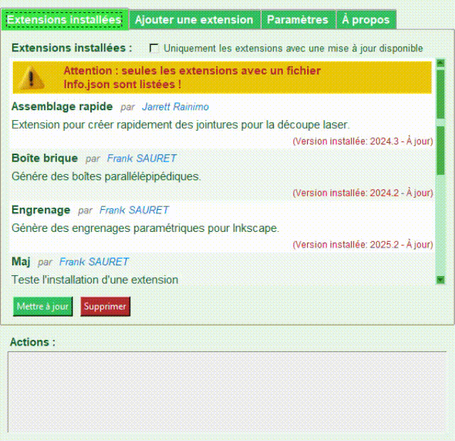

# ✨ Gestionnaire d’extensions Inkscape – Maj

 **Maj** est un gestionnaire d’extensions pour Inkscape, permettant d’installer, mettre à jour, valider et gérer facilement vos extensions depuis une interface graphique moderne.

- 🟢 **Vous développez des extensions InkScape ?** Vous pouvez utiliser ce gestionnaire simplement. [Cliquez ici pour voir l’aide](https://franksauret.github.io/Maj/).


## 🚀 Fonctionnalités principales

> Toutes ces fonctions sont accessibles directement depuis l’exécutable Windows autonome, sans avoir besoin d’ouvrir Inkscape.

- **🔍 Scan des extensions installées**  
	Parcourt le dossier utilisateur, détecte les extensions, affiche leur état et version.

- **📦 Installation & désinstallation**  
	Installe ou retire des extensions en un clic.

- **🛠️ Mise à jour** 
	Vérifie les mises à jour disponibles et propose l’upgrade des extensions obsolètes.

- **🌐 Gestion des dépôts**  
	Supporte les dépôts GitHub, Gitlab, Codeberg et Bitbucket, avec ajout/suppression de sources. Possibilité aisée d'ajout d'autre dépot. Attention seul Github a été testé.

- **🖼️ Interface graphique personnalisée**  
	Utilise Tkinter avec des widgets colorés et styles configurables.

## 🖥️ Aperçu de l’interface


## ⚙️ Structure du projet

```
Maj/
│
├── core/         # Logique métier : installer, valider, updater, gestion des dépôts
├── gui/          # Interface graphique Tkinter, widgets personnalisés
├── data/         # Configurations, listes d’extensions, dépôts
├── assets/       # Icônes, images
├── locale/       # Traductions
└── Maj.py        # Point d’entrée
```

## 📚 Installation

1. Copier le sous-dossier `Maj` dans le répertoire des extensions Inkscape.
2. Dans InkScape, lancer `Extension > Mise à jour des extensions de Frank SAURET` pour démarrer le gestionnaire (tout en bas du menu).

## 🪟 Version exécutable Windows

Un exécutable Windows (.exe) est disponible : il permet d’installer, mettre à jour et gérer directement vos extensions Inkscape, sans passer par Inkscape lui-même.

- Téléchargez et lancez simplement le fichier `Maj.exe`.
- Toutes les fonctionnalités sont accessibles depuis l’interface graphique.
- Idéal pour gérer vos extensions en dehors d’Inkscape, ou sur une machine sans installation complète d’Inkscape.

## 👨‍💻 Auteur & Licence

- **Auteur** : Frank SAURET & GitHub Copilot
- **Licence** : GPLv2
---


